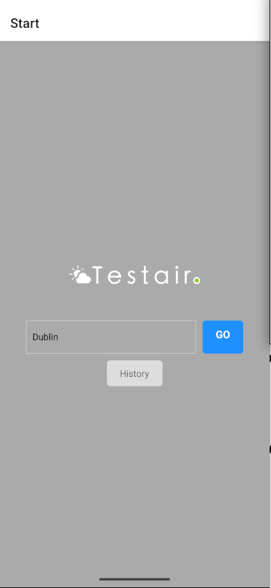
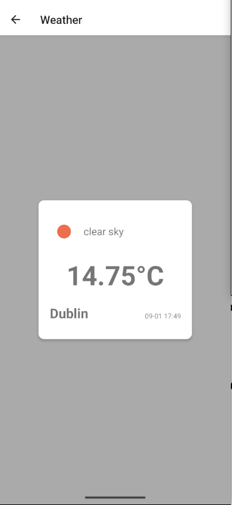
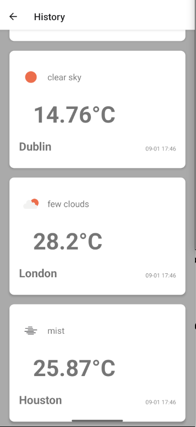

## Weather App

This is a mobile app built on React Native which allows users to check current weather in any city in the world.

The app consists of three screens: Home, Search and History

### Home Screen

In this screen user is prompted to enter the name of the city.

### Search Screen

This screen displayes the result about the queried city.

### History Screen

In this screen user can view his last 5 searches.

## Code organization

The entry point of the program is `App.tsx`.

The screens are defined in the `screens` folder. Components are defined in `components` folder.

Finally, data fetching logic is stored in `weatherApi` service inside `services` folder
